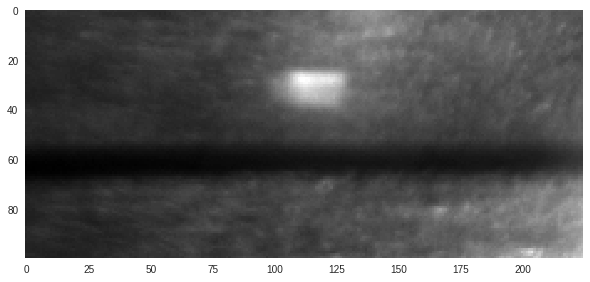
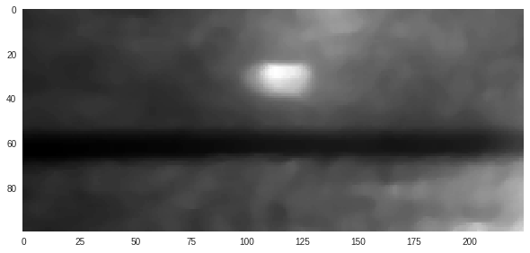
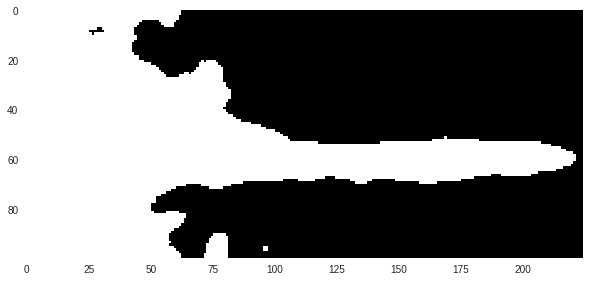
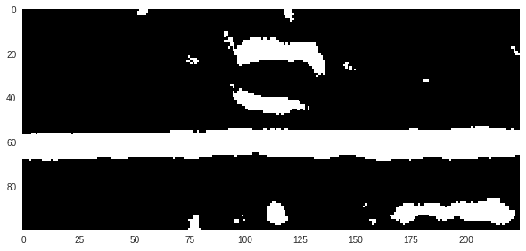
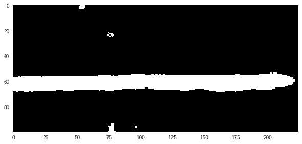

# Background

One of my consultancy assingments involved aiding the project [VarGa](https://www.ltu.se/research/subjects/Produktionsutveckling/Forskningsprojekt/VarGa-1.160277) with computer vision to extract information from a video stream. The project's aim was to improve the performance and reliability of a closed-loop automatic system for laser welding.

In this post, I present the basic idea for my computer vision algorithm. The prototyping was done in a Google Colab Python notebook, whereas the finished product was implemented in C# for increased performance.

# Algorithm

The algorithm starts by selecting a small part of the captured frame, in which the desired information should be found. A resulting so-called *region of interest* (ROI) typically looks like this:



The center of the image holds the desired information: a horisontal black band with a certain width and offset from the top of the image. My task was to extract the width and offset of the band. The problem was made trickier by the fact that the lightning conditions could vary considerably and that disturbances such as dust particles might show up as dark countours above or below the desired band.

The first step was to blur the image in order to reduce noise. OpenCV readily offers two methods for blurring an image: *Gaussian* and *Median* blur. When blurring an image, each output pixel is a weighted average of its surrounding pixels. For median blur, all weights are set to 1, which makes each output pixel equal to the mean intensity of its surrounding pixels. For Gaussian blur, the weights are set such that each output pixel is affected more by neighbouring pixels than pixels that are further away. A helpful tutorial on image smoothing with OpenCV can be found here: [link](https://docs.opencv.org/3.1.0/d4/d13/tutorial_py_filtering.html).

After some experimentation, I decided to use a median blur. The results of applying the blur is:



```python
blurred_img = cv2.medianBlur(roi, 7)
```
		
Now to the fun part - isolating the band from the background!

Although the lightning conditions change during a welding sequence and between different hardware setups, one fact remains true: the band is always darker than its surroundings. Therefore, my strategy was to use some kind of thresholding operation to extract the band. In short, a thresholding operation assigns all pixels below a certain threshold the value "0", and "1" if they are above.

Since the lightning conditions differ, however, a static threshold cannot be used. Instead, I chose to use the average pixel brightness as a reference point for my threshold. Simply using the average intensity turned out to not be enough. Much better results were consistently obtained if the threshold was set to 85% of the average intensity. For the blurred image above, the resulting binary image from the thresholding operation using a dynamic threshold is:



```python
mean_intensity = cv2.mean(blurred_img)[0]
threshold_factor = 0.85
threshold = int(mean_intensity * threshold_factor)
```

Apparently, this *global* thresholding operation manages to extract the band in the right part of the image, but fails in the left part. The reason is that the overall brightness level is lower in the left part of the image than the right part. In effect, this means that a thresholding operation cannot be used on its own.

Another method to binarise an image is to use an *adaptive threshold*, where a standard thresholding operation is applied to small regions of the image. In each region, the threshold is set to the average brightness of the pixels within the region. The result is remarkable:



```python
block_size = 31
delta = 6
adaptive_threshold_img = cv2.adaptiveThreshold(blurred_img, 255, cv2.ADAPTIVE_THRESH_MEAN_C, cv2.THRESH_BINARY_INV, block_size, c)
```

The band is extracted throughout the entire ROI even though the overall brightness changes. A side effect is, however, that random noise in the background results in small "islands" of white pixels where local contrasts are adequately high. But, since the brightness level of those pixels are high compared to the average of the entire image, the islands in the background are abscent in the result of the global thresholding operation.

Therefore, an even better extraction is achieved if the results of each thresholding operation are combined into one binary image. Since the images are binary, this is easily achieved by a logical AND-operation:



```python
combined_thresholds_img = cv2.bitwise_and(global_threshold_img, adaptive_threshold_img)
```

The combined image holds the desired location and shape of the band as in the result from the adaptive thresholding operation, but without much of the noise thanks to the global threshold. Thus, it is a good starting point for further operations aimed at handling edge cases and preventing incorrect classifications.