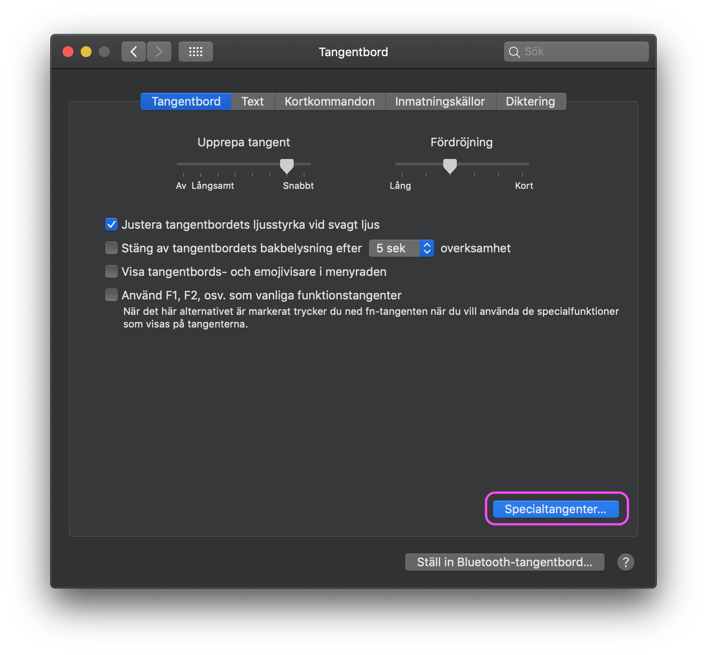

Having recently fininshed five years of studies at a university, my MacBook was littered with various Python versions, unfinished assignments, directories for shared files no longer relevant, etc.. It very much felt like I needed to remove everything and start with a clean slate

# Settings

## Remap caps lock to escape

I'm an avid Vim user, which means that one of the most frequently used keys when I'm working is Escape. A key which I (and most of humanity) find the least use for is Caps Lock. Therefore, I remap my Caps Lock key to work as an extra Escape key instead.

This is done by going into System Preferences -> Keyboard -> Modifier Keys... and changing the Caps Lock key to Escape.

## Activate selection in all dialog boxes

In a vanilla macOS, when a dialog box appears, the default key is marked for quick selection using the Return key. In order to press one of the not default buttons, one has to use the mouse. It is, however, possible to enable selection also of not default buttons.

Go to System Preferences -> Keyboard and click on the "Keyboard Shortcuts" tab. Below the box with all the shortcuts are two Radio Buttons. Make sure that the Radio Button with the text "All controls" is selected.

## Show full path in Finder
In the Finder, seeing the full path to a selected directory or file is more convenient than seeing only the name. To enable this, open a terminal program of choice and type

`defaults write com.apple.finder _FXShowPosixPathInTitle -bool true; killall Finder`

To disable it, instead type

`defaults write com.apple.finder _FXShowPosixPathInTitle -bool false; killall Finder`

In order to also show the full path at the bottom of the Finder window, click on the menu bar item "View" and select "Show Path Bar". This not only shows the full path, but also allows the user to right-click on the path and copy it as path string, which is nifty.

[Link to source of information](https://www.tekrevue.com/tip/show-path-finder-title-bar/)

## Show the status field in the Finder

Several macOS versions ago (back when it was still named OS X) the Finder by default showed a status field at the bottom of each Finder window. The status window states

- How many files that are selected
- How many files that the current directory contains
- How much available space that is available on the drive on which the current directory resides

Having this information available at a glance is very convenient. Luckily, it is still possible to enable the status field.

To enable/disable it, activate Finder and click on the menu bar item "View" and then on the item "Show Status Bar".

[Link to this tip, and a few more](https://www.macrumors.com/guide/top-tips-macos-finder/)
